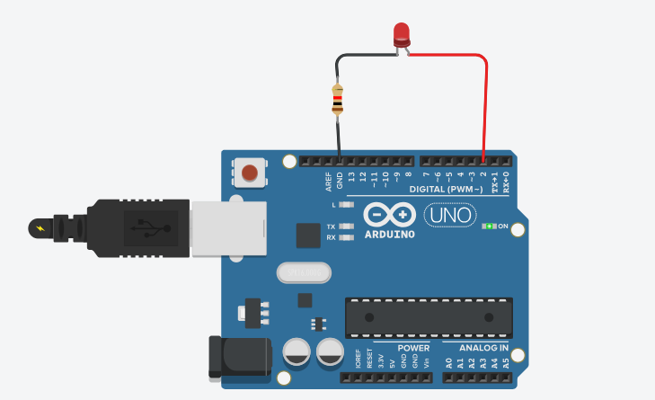

# Arduino Learning Journey

This repository documents my learning journey with Arduino. 
It includes my initial experiments, the challenges I faced, and the progress made while understanding embedded systems concepts. 
Each project contains code, circuit details, and notes to help reflect on what I learned.

---

## Project 1: Blink LED

**Components Used:**  
- Arduino Uno  
- 1 x LED  
- 220Ω Resistor  
- Jumper Wires

**Description:**  
This was the first step in learning Arduino. The LED is programmed to turn ON and OFF with a 1-second delay.  
This project helped me understand basic digital pin control and timing using the `delay()` function.

**Skills Learned:**  
- Writing basic Arduino code  
- Using digital output pins (`pinMode`, `digitalWrite`)  
- Implementing simple delays  

**Circuit Screenshot:**  

**Code:**  
See: `blink_led.ino`

---

More projects will be added as I continue learning and building.
