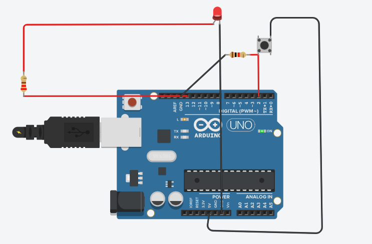
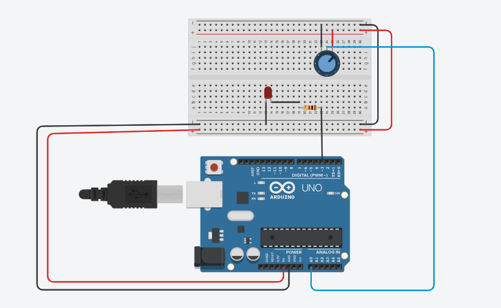

# Arduino Learning Journey

This repository documents my learning journey with Arduino. 
It includes my initial experiments, the challenges I faced, and the progress made while understanding embedded systems concepts. 
Each project contains code, circuit details, and notes to help reflect on what I learned.

---

## Project 1: Blink LED

**Components Used:**  
- Arduino Uno  
- 1 x LED  
- 220Ω Resistor  
- Jumper Wires

**Description:**  
This was the first step in learning Arduino. The LED is programmed to turn ON and OFF with a 1-second delay.  
This project helped me understand basic digital pin control and timing using the `delay()` function.

**Skills Learned:**  
- Writing basic Arduino code  
- Using digital output pins (`pinMode`, `digitalWrite`)  
- Implementing simple delays  

**Circuit Screenshot:**  

**Code:**  
See: [blink_led.ino](./blink_LED.ino)

---

## Project: LED Blink with Push Button Control

**Components Used:**  
- Arduino Uno  
- 1 x LED  
- 220Ω Resistor  
- 1 x Push Button  
- Jumper Wires

**Description:**  
In this project, the LED only blinks when the push button is pressed.  
The button acts as a digital input signal, and the microcontroller checks its state to control the LED blinking.  
This project helped me understand input pin reading, debouncing basics, and conditional control of digital outputs.

**Skills Learned:**  
- Reading digital input using `digitalRead()`  
- Using conditional statements (`if` statements)  
- Controlling LED state based on user input  
- Understanding pull-up/pull-down behavior

**Circuit Screenshot:**  

**Code:**  
See: [button_led_blink.ino](./button_led_blink.ino)

## Project: LED Brightness Control Using Potentiometer

**Components Used:**  
- Arduino Uno  
- LED  
- 220Ω Resistor  
- Potentiometer  
- Breadboard & Jumper Wires

**Description:**  
This project controls LED brightness using a potentiometer. The analog input from the potentiometer is mapped to a PWM output to control brightness.

**Skills Learned:**  
- analogRead()
- map()
- PWM with analogWrite()

**Circuit Screenshot:**  

**Demo Video:**  
[https://drive.google.com/your_shared_link_here](https://drive.google.com/file/d/1yaWHLbJruZZDHO297kQMmp6ePmcrm78w/view?usp=sharing)

**Code:**  
See: [potentiometer_controlled_led_brightness.ino](./potentiometer_controlled_led_brightness.ino)

More projects will be added as I continue learning and building.
